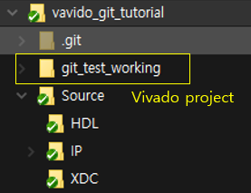

  
Vivado project 폴더를 git으로 관리하려고 하면 vivado 프로그램 자체에서 생성하는 파일들이 매우 많을 뿐만아니라 상황에 따라서 50MB, 100MB이상의 파일이 생성되어 github 등의 서비스 이용에 불편이 있을 수 있기 때문에 프로젝트 폴더의 모든 파일을 git으로 관리하는것은 매우 비효율적입니다.

vivado project는 아래와 같은 방법을 사용하여 git으로 관리 할 수 있습니다. 


`HDL source 파일 및 vivado의 IP 파일을 vivado project 폴더와 구분하여 별도의 폴더로 관리하는 것이 관리하기가 편합니다.`  


  

위와 같이 git으로 관리되는 폴더 아래에 vivado project 폴더와 소스 폴더를 구별하여 정리합니다.

`vivado project를 컴파일 한 후 해당 프로젝트를 commit 하고자 하면 아래와 같이 vivado project를 자동으로 생성하도록 해주는 TCL 파일을 만들어 준 뒤에 소스파일과 해당 tcl 파일만을 git으로 관리해주는 것이 좋습니다.`

  

HDL 파일이나 IP 파일은 별도의 폴더에서 관리하므로 "copy source to new project"에 체크할 필요는 없습니다. 생성되는 tcl 파일은 git으로 관리하려고 하는 project 폴더의 상위 위치에 저장합니다.  
저는 "build.tcl"로 저장했습니다.  

  

`현재 작업중인 project 폴더는 git으로 관리 할 것이 아니기 때문에 .gitignore 파일에 해당 폴더를 등록합니다.`  

```
git_test_working/
```

`git clone 후에 자동으로 project를 만들기 위해 위에서 저장한 build.tcl 파일을 실행해 주어야 하며 이를 편하게 하기 위하여 아래와 같이 "make_project.bat"라는 파일을 만들어줍니다.`

```
d:\Xilinx\Vivado\2022.1\bin\vivado.bat -mode tcl -source build.tcl
pause
```  

이제 commit 합니다.  
위의 예제는 아래에서 확인 할 수 있습니다.  

[vavido_git_tutorial](https://github.com/jeongcho/vavido_git_tutorial)  

이제 해당 project를 clone 한 후 "make_project.bat" 파일을 실행하면 "build.tcl"을 생성했던 시점의 vivado project 폴더가 자동으로 생성됩니다.